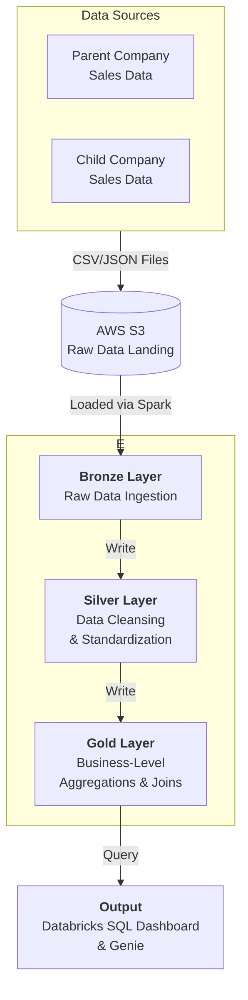

# End-to-End Data Engineering Project: FMCG M&A Data Consolidation on Databricks (Free Edition)

---

## 🚀 Project Overview


This project is an end-to-end Data Engineering pipeline built for a realistic industry use case in the FMCG (Fast-Moving Consumer Goods) domain. The scenario involves a large retail company acquiring a smaller one, and the goal was to build a robust ETL pipeline on the Databricks Free Edition to consolidate data from both companies into a single, unified Lakehouse architecture.

This project is designed for both beginners and advanced users looking to understand modern data engineering practices using a powerful tech stack.

---

## 🎯 The Business Problem: M&A Data Consolidation

When a big company acquires a smaller one, a critical challenge is merging their data landscapes.

This project simulates two separate data sources:

- **Parent Company:** Historical sales data  
- **Child Company:** Recent sales data  

The objective was to build a pipeline that ingests, cleans, transforms, and enriches this combined data to provide a single source of truth for business analysis.

---

## 🛠️ Tech Stack & Tools

- **Cloud Storage:** Amazon S3  
- **Data Processing:** Apache Spark  
- **Platform:** Databricks (Free)  
- **Language:** Python (PySpark), SQL  
- **Architecture:** Medallion Architecture (Bronze, Silver, Gold)  
- **Orchestration:** Databricks Notebooks  
- **BI & Reporting:** Databricks SQL Dashboard & Genie  

---

## 🏗️ Architecture Diagram


---

## 📂 Project Structure

```
End-to-End-Data-Engineering-Databricks-FMCG

├── data/
│   ├── parent_company/
│   │   ├── full_load/
│   │   └── incremental_load/
│   │
│   ├── child_company/
│       ├── full_load/
│       └── incremental_load/

├── notebooks/
│   ├── 01_setup/
│   ├── 02_dimension_processing/
│   ├── 03_fact_processing/

├── dashboards/
│   └── (Power BI / BI files)

├── resources/
│   └── (architecture diagrams, images, docs)

├── README.md

```

---

## 📝 Step-by-Step Pipeline Implementation

### 1. Bronze Layer: Raw Data Ingestion

- Uploaded raw CSV files to Amazon S3  
- Loaded data into Bronze Delta tables using PySpark  
- Maintained raw, immutable data  

---

### 2. Silver Layer: Data Cleansing & Transformation

- Standardized schemas and column names  
- Handled null values and removed duplicates  
- Created derived columns (year, month, quarter)  

Output: Clean, structured Silver Delta tables  

**Sample Silver Layer Cleaning script**

```python
# 1. Keep only rows where order_qty is present
df_orders = df_orders.filter(F.col("order_qty").isNotNull())


# 2. Clean customer_id → keep numeric, else set to 999999
df_orders = df_orders.withColumn(
    "customer_id",
    F.when(F.col("customer_id").rlike("^[0-9]+$"), F.col("customer_id"))
     .otherwise("999999")
     .cast("string")
)

# 3. Remove weekday name from the date text
#    "Tuesday, July 01, 2025" → "July 01, 2025"
df_orders = df_orders.withColumn(
    "order_placement_date",
    F.regexp_replace(F.col("order_placement_date"), r"^[A-Za-z]+,\s*", "")
)

# 4. Parse order_placement_date using multiple possible formats
df_orders = df_orders.withColumn(
    "order_placement_date",
    F.coalesce(
        F.try_to_date("order_placement_date", "yyyy/MM/dd"),
        F.try_to_date("order_placement_date", "dd-MM-yyyy"),
        F.try_to_date("order_placement_date", "dd/MM/yyyy"),
        F.try_to_date("order_placement_date", "MMMM dd, yyyy"),
    )
)

# 5. Drop duplicates
df_orders = df_orders.dropDuplicates(["order_id", "order_placement_date", "customer_id", "product_id", "order_qty"])

# 5. convert product id to string
df_orders = df_orders.withColumn('product_id', F.col('product_id').cast('string'))

```
---

### 3. Gold Layer: Business-Level Aggregation

- Sales by product category  
- Top performing stores  
- Monthly sales trends  

**Sample Gold Layer view**

```sql
CREATE OR REPLACE VIEW fmcg.gold.vw_fact_orders_enriched AS (
    SELECT 
        fo.date,
        fo.product_code,
        fo.customer_code,

        -- Date attributes
        dd.date_key,
        dd.year,
        dd.month_name,
        dd.month_short_name,
        dd.quarter,
        dd.year_quarter,

        -- Customer attributes
        dc.customer,
        dc.market,
        dc.platform,
        dc.channel,

        -- Product attributes
        dp.division,
        dp.category,
        dp.product,
        dp.variant,

        -- Metrics
        fo.sold_quantity,
        gp.price_inr,

        -- Derived Metric: Amount
        (fo.sold_quantity * gp.price_inr) AS total_amount_inr
    
    FROM fmcg.gold.fact_orders fo

    -- Join with Date Dimension
    LEFT JOIN fmcg.gold.dim_date dd
           ON fo.date = dd.month_start_date

    -- Join with Customers
    LEFT JOIN fmcg.gold.dim_customers dc 
           ON fo.customer_code = dc.customer_code

    -- Join with Products
    LEFT JOIN fmcg.gold.dim_products dp 
           ON fo.product_code = dp.product_code

    -- Join with Price (year-based)
    LEFT JOIN fmcg.gold.dim_gross_price gp 
           ON fo.product_code = gp.product_code
          AND YEAR(fo.date) = gp.year
);


-- Preview
SELECT * FROM fmcg.gold.vw_fact_orders_enriched;

```
Output: Aggregated, analytics-ready Gold tables  

---

### 4. Reporting & Analysis

- Built dashboards using Databricks SQL  
- Explored Genie for conversational queries  

Example:
> “What were the top 5 selling products last month?”

---

## ⚙️ How to Run This Project

### Prerequisites

- Databricks Community Edition account  
- AWS S3 bucket (or DBFS alternative)  

### Setup

1. Clone repository  
2. Upload CSV files to S3 or DBFS  

### Execution

1. Import notebooks into Databricks  
2. Update file paths in ingestion notebook  
3. Run notebooks in order:
   - Bronze → Silver → Gold  
4. Build dashboard using Gold tables  

---

## 💡 Key Learnings

- Built a Medallion Architecture from scratch  
- Used PySpark for distributed processing  
- Simulated real-world M&A data consolidation  
- Delivered business-ready analytics outputs  
- Leveraged Databricks Free Edition effectively  

---

## 🙏 Credits

This project was inspired by the tutorial from **codebasics**: 

---

# 📫 Contact

## Oluwatosin Amosu Bolaji 
- Data Engineer 
- Buiness Intelligence Analyst
- ETL Developer

#### 🚀 **Always learning. Always building. Data-driven to the core.**  

### 📫 **Let’s connect!**  
- 📩 oluwabolaji60@gmail.com
- 🔗 : [LinkedIn](https://www.linkedin.com/in/oluwatosin-amosu-722b88141)
- 🌐 : [My Portfolio](https://www.datascienceportfol.io/oluwabolaji60) 
- 𝕏 : [Twitter/X](https://x.com/thee_oluwatosin?s=21&t=EqoeQVdQd038wlSUzAtQzw)
- 🔗 : [Medium](https://medium.com/@oluwabolaji60)
- 🔗 : [View my Repositories](https://github.com/Tbrown1998?tab=repositories)
